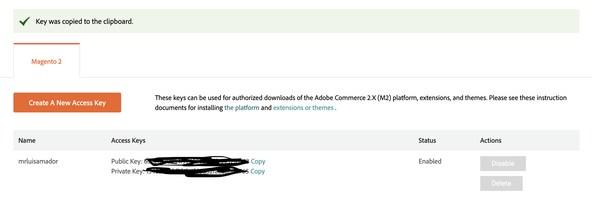
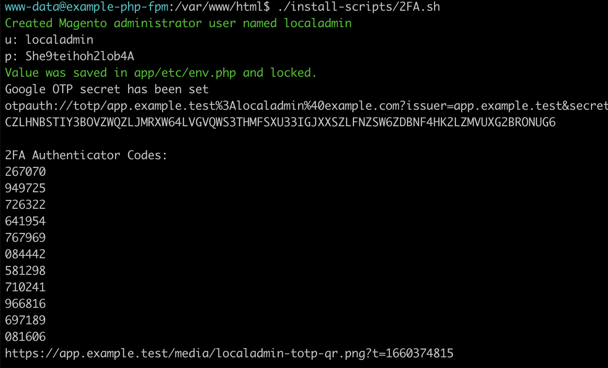

#### Prerequisite
In order to get this all configured and working right you have to have the following done first:

- [Authenticator](https://chrome.google.com/webstore/detail/authenticator/bhghoamapcdpbohphigoooaddinpkbai) Chrome extension
- [Warden CLI](https://docs.warden.dev/installing.html) installed on your local machine.
- [Docker](https://www.docker.com/) installed on your local machine.
- Your credential keys from the [Magento Marketplace](https://marketplace.magento.com/).
  
- A copy of this repo pulled down to your local machine
```bash
git pull repo
```

1. Create a new directory on your host machine at the location of your choice and then jump into the new directory to get started:
```bash
mkdir -p ~/Sites/magento2
cd ~/Sites/magento2
```

2. Sign an SSL certificate for use with the project (the input here should match the value of *TRAEFIK_DOMAIN* in the *.env* file):
```bash
warden sign-certificate magento2.test
```

3. Next you’ll want to start the project environment:
```bash
warden env up
```

4. Drop into a shell within the project environment. Commands following this step in the setup procedure will be run from within the *php-fpm* docker container this launches you into:
```bash
warden shell
```

5. Run composer install
```bash
composer install
```

6. Run the follow script to configure the database
```bash
./install-scripts/installMagento.sh
```

7. Run the follow script to configure the backend admin 
```bash
./install-scripts/2FA.sh
```
Be sure to write down the *user* and *password* the script generates for you.



8. Launch the application in your browser and get to work:

- https://app.magento2.test/
- https://app.magento2.test/backend/
- https://rabbitmq.magento2.test/
- https://elasticsearch.magento2.test/
- https://mailhog.warden.test/
